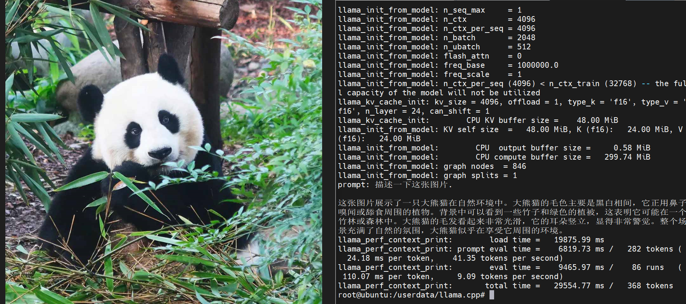

# llama.cpp compile for InternVL and SmolVLM run on bpu


## 简介
  本项目是一个RDK X5/S100 平台运行 [书生多模态大模型](https://huggingface.co/OpenGVLab/InternVL2_5-1B) 的示例, 具体模型参数 InternVL2_5-1B。
  目前添加了对SmolVLM系列模型推理支持（暂时只提供RDK X5上的支持）。

  项目组成:
  
  - 第三方 [llama.cpp](https://github.com/ggerganov/llama.cpp) 部署方案
  - InternVL模型文件: 包含图像编码模型 vit_model_int16.bin(vit_model_int16.hbm), 语言解码模型 Qwen2.5-0.5B-Instruct-F16.gguf.
  - SmolVLM模型文件: 包含图像编码模型 vit_model_int16_SmolVLM2_500M_Instruct_X5.bin, 语言解码模型 SmolVLM2-500M-Video-Instruct-Q8_0.gguf
  - 示例运行文件: 需要替换到 llama.cpp 指定目录下。

## 准备工作

- 模型下载
  下载地址 https://huggingface.co/QIANCHEN100/InternVL2_5-1B-GGUF-BPU

### RDK X5
- 准备一块 [RDK X5](https://developer.d-robotics.cc/rdkx5) 开发板

- 代码下载

```shell
# 拉取代码
git clone https://github.com/ggerganov/llama.cpp -b b4749

# 替换示例文件
cd llama.cpp
cp ../src/x5/* ./examples/llava
```

- 在 [RDK X5](https://developer.d-robotics.cc/rdkx5) 平台上编译
```shell
cmake -B build
cmake --build build --config Release -j8
```

### RDK S100
- 准备一块 RDK S100 开发板（即将上线） 

- 代码下载

```shell
# 拉取代码
git clone https://github.com/ggerganov/llama.cpp -b b4749

# 替换示例文件
cd llama.cpp
cp ../src/s100/* ./examples/llava
```

- 在 RDK S100 平台上编译
```shell
cmake -B build
cmake --build build --config Release -j6
```

## 运行

### InternVL in RDK X5
```
./build/bin/llama-intern2vl-bpu-cli -m ./Qwen2.5-0.5B-Instruct-F16.gguf --mmproj ./vit_model_int16.bin --image image2.jpg -p "描述一下这张图片." --temp 0.5 --threads 8
```
### SmolVLM in RDK X5, 请注意SmolVLM系列模型只支持**英文**
```
./build/bin/llama-smolvlm-bpu-cli -m ./SmolVLM2-500M-Video-Instruct-Q8_0.gguf --mmproj ./vit_model_int16_SmolVLM2_500M_Instruct_X5.bin --image image2.jpg -p "Describe the image in one sentence." --temp 0.5 --threads 8
```

### RDK S100
```
./build/bin/llama-intern2vl-bpu-cli -m ./Qwen2.5-0.5B-Instruct-F16.gguf --mmproj ./vit_model_int16.hbm --image image2.jpg -p "描述一下这张图片." --temp 0.5 --threads 4
```

运行结果:



## 附录

[如何导出语言模型？](./utils/README.md)
